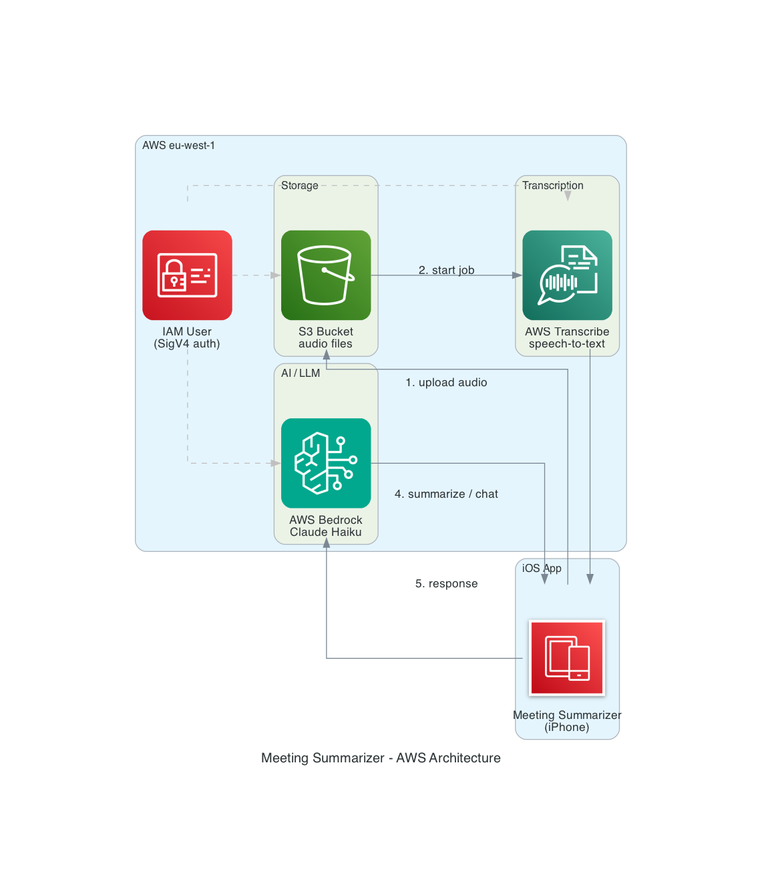

# Meeting Summarizer

An iOS app that records or imports meeting audio, transcribes it using AWS Transcribe, and generates AI-powered summaries and Q&A via AWS Bedrock (Claude).

## Features

- 🎙️ **Record meetings** directly in-app
- 📁 **Import audio files** from your iPhone (Voice Memos, Files app, etc.)
- ☁️ **AWS Transcribe** integration for accurate speech-to-text
- 🤖 **AI summaries** powered by Claude on AWS Bedrock
- 💬 **Chat with your transcript** — ask questions like "What were the action items?"
- 🗂️ **Meeting history** — browse and reload past transcriptions
- 💾 **Local transcript cache** — avoids redundant AWS calls and reduces cost
- 🗑️ **Delete jobs** — removes both transcript and audio from AWS

## Requirements

- iOS 17+
- Xcode 15+
- An AWS account with:
  - S3 bucket
  - AWS Transcribe access
  - AWS Bedrock access (Claude model enabled in your region)
  - IAM user with appropriate permissions

## Configuration

Before building, set your AWS credentials in `MeetingSummarizer/Config.swift`:

```swift
enum Config {
    static let awsAccessKey = "YOUR_AWS_ACCESS_KEY"  # pragma: allowlist secret
    static let awsSecretKey = "YOUR_AWS_SECRET_KEY"  # pragma: allowlist secret
    static let awsRegion    = "eu-west-1"
    static let s3Bucket     = "your-s3-bucket-name"
    static let bedrockModel = "eu.anthropic.claude-haiku-4-5-20251001-v1:0"  # pragma: allowlist secret
}
```

> ⚠️ **Never commit real credentials to source control.** Add `Config.swift` to your `.gitignore` or use a secrets manager.

### Required IAM Permissions

```json
{
  "Effect": "Allow",
  "Action": [
    "s3:PutObject",
    "s3:GetObject",
    "s3:DeleteObject",
    "transcribe:StartTranscriptionJob",
    "transcribe:GetTranscriptionJob",
    "transcribe:ListTranscriptionJobs",
    "transcribe:DeleteTranscriptionJob",
    "bedrock:InvokeModel"
  ],
  "Resource": "*"
}
```

## Architecture



## Getting Started

1. Clone the repo
2. Open `MeetingSummarizer.xcodeproj` in Xcode
3. Fill in `Config.swift` with your AWS credentials
4. Select your target device or simulator
5. Build and run (`⌘R`)

See [QUICK_START_GUIDE.md](QUICK_START_GUIDE.md) for a walkthrough of each feature.

For a deep dive into how everything works under the hood, see [DESIGN.md](DESIGN.md).

## Architecture

- **SwiftUI** — UI layer
- **AVFoundation** — audio recording and processing
- **AWS SigV4** — hand-rolled request signing (no SDK dependency)
- **AWS S3** — audio file storage
- **AWS Transcribe** — speech-to-text
- **AWS Bedrock (Claude)** — summarisation and chat
- **Core Data** — local meeting history
- **AppStorage** — transcript caching and deduplication

## Known Issues / Future Work

- No offline mode (local speech-to-text not yet implemented)
- Single language support (English)
- No iCloud sync between devices

## Roadmap

See [TODO.md](TODO.md) for the full list of planned improvements. Highlights for the next release:

- Migrate credentials to AWS Cognito Identity Pools (no hardcoded keys)
- Exponential backoff for transcription polling
- Multi-language support (AWS Transcribe supports 30+ languages)
- Persist chat history per meeting
- Speaker identification (AWS Transcribe diarization)

## Built With AI

This app was built in ~2 hours using [Amazon Kiro](https://kiro.dev) — an AI-powered IDE that supports spec-driven and vibe coding workflows. The architecture, features, and implementation were created and designed by me, but developed through Kiro's agentic coding experience.

## Security

This project uses [AWS Automated Security Helper (ASH)](https://github.com/awslabs/automated-security-helper) for automated security scanning. ASH runs automatically on every commit via pre-commit hooks to detect hardcoded secrets, vulnerabilities, and other security issues before they reach source control.

To run a manual scan:
```bash
# Install ASH
alias ash="uvx git+https://github.com/awslabs/automated-security-helper.git@v3.0.0"

# Run scan
ash --mode local
```

## License

MIT
